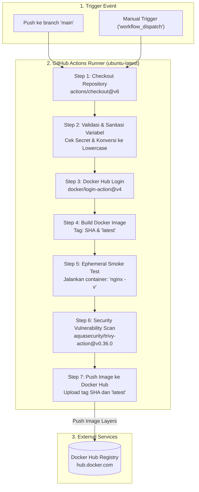
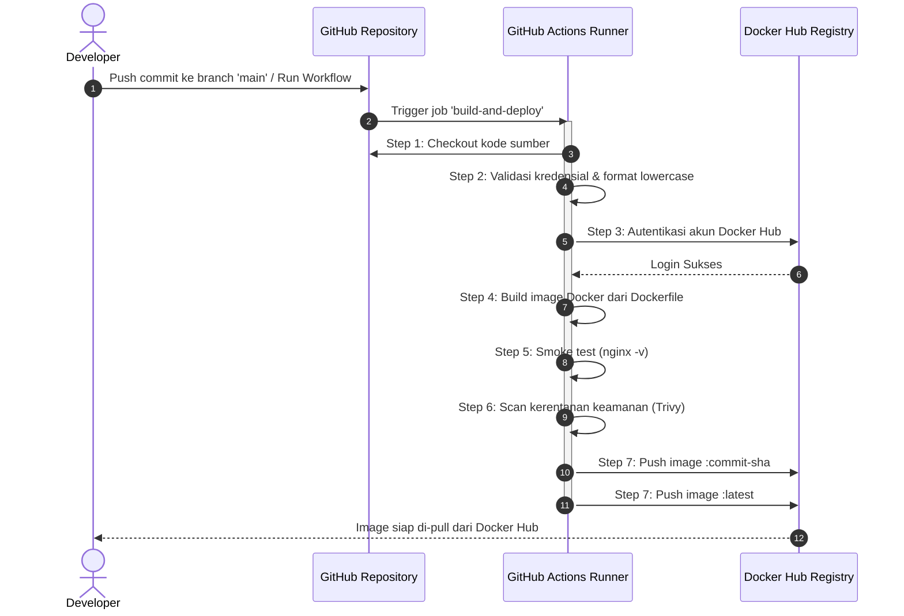

# CI/CD Pipeline Architecture: Build & Push Docker Image

Dokumen ini mendokumentasikan arsitektur dan alur kerja (*pipeline*) otomatisasi CI/CD yang dikonfigurasi menggunakan **GitHub Actions** pada repositori ini.

---

## 1. Diagram Alur Proses (Pipeline Flowchart)

Alur kerja berikut berjalan secara otomatis di runner **Ubuntu** (`ubuntu-latest`) saat ada *event* tertentu:

---

## 2. Sequence Diagram Interaksi Komponen

Diagram berikut menggambarkan interaksi antara Developer, GitHub, Runner, dan Docker Hub Registry:

---

## 3. Rincian Setiap Tahapan (*Steps*)

| No | Tahapan (*Step*) | Action / Perintah | Deskripsi & Tujuan |
|---|---|---|---|
| **1** | **Source Checkout** | `actions/checkout@v6` | Mengambil (*fetch*) seluruh kode sumber repositori ke dalam direktori kerja runner. |
| **2** | **Validasi & Format Variabel** | Bash Shell Script | Memvalidasi keberadaan kredensial (`DOCKERHUB_USERNAME` & `DOCKERHUB_TOKEN`). Mengonversi nama repositori dan username ke format huruf kecil (*lowercase*) sesuai standar penamaan Docker. |
| **3** | **Docker Hub Login** | `docker/login-action@v4` | Melakukan otentikasi aman ke Docker Hub menggunakan kredensial rahasia yang tersimpan di GitHub Secrets. |
| **4** | **Build Docker Image** | `docker build` | Membangun image Docker berdasarkan `Dockerfile` dan langsung menyematkan 2 tag: `:commit-sha` dan `:latest`. |
| **5** | **Smoke Test Container** | `docker run --rm ... nginx -v` | Menjalankan container secara *ephemeral* untuk memastikan runtime Nginx berjalan normal sebelum image dipublikasikan. |
| **6** | **Trivy Vulnerability Scan** | `aquasecurity/trivy-action@v0.36.0` | Memindai paket OS dan *library* di dalam container untuk mencari celah keamanan (*CVE*). Berjalan secara informatif (`exit-code: '0'`, `continue-on-error: true`). |
| **7** | **Push to Docker Hub** | `docker push` | Mengunggah layer image Docker beserta tag commit SHA dan tag `latest` ke Docker Hub. |

---

## 4. Konfigurasi Kredensial & Lingkungan

Alur kerja ini memerlukan konfigurasi rahasia pada menu **Settings > Secrets and variables > Actions** di repositori GitHub:

* **`DOCKERHUB_USERNAME`**: Username akun Docker Hub tempat image disimpan.
* **`DOCKERHUB_TOKEN`**: Personal Access Token (PAT) Docker Hub dengan izin *Read & Write*.

> [!NOTE]
> Alur kerja ini mendukung pembacaan kredensial baik dari **GitHub Secrets** maupun **GitHub Variables** secara fleksibel menggunakan sintaks fallback: `${{ secrets.DOCKERHUB_USERNAME || vars.DOCKERHUB_USERNAME }}`.

---

## 5. Strategi Penandaan (*Image Tagging Strategy*)

Setiap kali alur kerja dijalankan, dua jenis tag dibuat dan diunggah ke registry:

1. **`:<commit-sha>`** (Contoh: `push-image:8b706fd...`):
   * Bersifat *immutable* (tidak dapat ditimpa).
   * Memudahkan pelacakan kode sumber (*auditability & traceability*) dari commit tertentu ke container yang sedang berjalan di *production*.
2. **`:latest`**:
   * Selalu menunjuk pada versi build paling baru dari branch `main`.
   * Memudahkan pengguna untuk menarik (*pull*) versi paling mutakhir secara instan tanpa perlu mengetahui hash commit.
